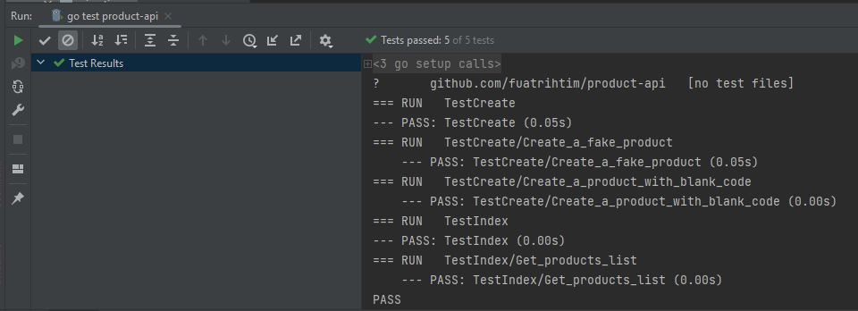

   <h3 align="center">Product API</h3>

### Table of Contents
  
<ol>
  <li>
    <a href="#about-the-project">About The Project</a>
    <ul>
      <li><a href="#built-with">Built With</a></li>
    </ul>
  </li>
  <li>
    <a href="#getting-started">Getting Started</a>
    <ul>
      <li><a href="#prerequisites">Prerequisites</a></li>
    </ul>
  </li>
  <li>
    <a href="#getting-started">Screenshots</a>
  </li>
</ol>

## About The Project

The project includes product endpoints which is for reading, creating, updating and deleting product.

The main point is to handle the operations with the project that written with Restful Go project!

### Built With

You can find the used technologies below.

	
	
	
	

 

## Getting Started

### Prerequisites

* You should have an IDE in order to reach out the code. I used GoLand. (https://www.jetbrains.com/go/).
* Go SDK should be installed. SDK is for development purposes and runtime is for running the project. (https://go.dev/dl/)
* Postman should be installed for the collections. (https://www.postman.com/downloads/) Requests are ready to use in collections so you can use it in order to test the API.
* You should have PostgreSQL to keep and track the data. (https://www.postgresql.org/download/)

### Screenshots

* You can find the integration tests below.
  